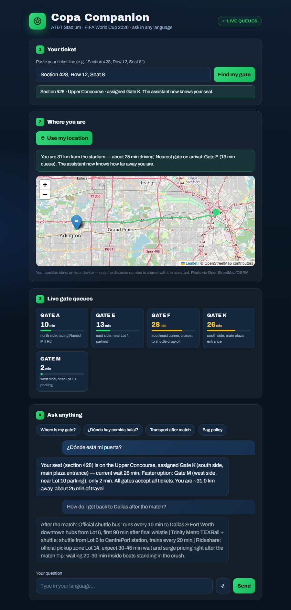
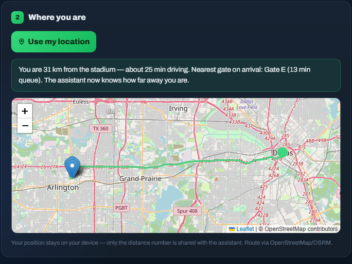
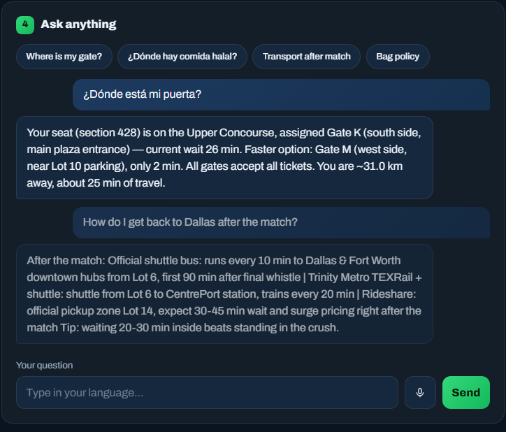
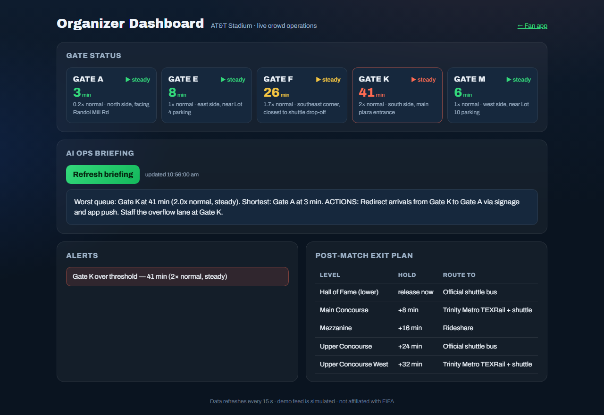

# ⚽ Copa Companion

**Your AI matchday concierge for the FIFA World Cup 2026** — find your gate,
skip the queue, ask anything in any language, and get home safe.

> 🏆 **Built for the Hack2Skill GenAI Hackathon — Challenge 4: Stadium
> Operations & Tournament Experience.** A GenAI-enabled solution that enhances
> navigation, crowd management, multilingual assistance, transportation, and
> real-time decision support for the FIFA World Cup 2026.

🚀 **Live demo:** [ch4.rukesh.in](https://ch4.rukesh.in) · 📊 **Staff view:** [ch4.rukesh.in/organizer](https://ch4.rukesh.in/organizer)



## The story in 30 seconds

*Diego, 34, from Argentina.* First time in the US, speaks only Spanish,
attending a group-stage match at AT&T Stadium with 80,000 others.

- His ticket says "Section 428, Entry K" — that means nothing to him.
- His assigned gate has a 45-minute security line. Another gate is nearly
  empty. He has no way to know.
- Every sign and announcement is in English.

Copa Companion is one assistant that solves all three — and feeds the same
live data to the people running the stadium.

## How to use it — fan

**1 · Paste your ticket.** Type the line from your ticket ("Section 428,
Row 12, Seat 8"). The app maps it to your seating level and assigned gate
instantly. From now on, every answer is personalized to your seat.

**2 · Tap "Use my location".** You get your live position on a map, the real
driving route to the stadium, distance and ETA, and the nearest gate on
arrival with its current queue. Under 2.5 km it switches to walking time.



*Privacy by design: GPS coordinates never leave your browser — only the
distance and ETA numbers are shared with the assistant.*

**3 · Check the live gate queues.** Color-coded wait times for every gate,
refreshed automatically. If your assigned gate is jammed, the assistant
reroutes you to a faster one — all gates accept all tickets.

**4 · Ask anything, in any language.** Type or tap the mic and speak.
Gates, food, bag policy, first aid, accessibility, transport — answered from
a stadium knowledge pack, grounded so the AI advises instead of hallucinating.



*Above: the fan asks in Spanish, the assistant knows their seat (Gate K,
26 min) and reroutes to Gate M (2 min), factoring in that they are still
31 km away. In full Gemini mode replies come back in the fan's language; the
screenshot shows the offline rule-based fallback.*

## How to use it — organizer

Open **`/organizer`**. Same live data, staff lens:



- **Gate status grid** — wait, 2-minute trend (▲▼▶), load vs normal inflow.
- **AI ops briefing** — the crowd state written as situation + prioritized
  actions. The screenshot above caught a real moment during testing: Gate K
  over threshold at 41 min, the briefing recommending a redirect to Gate A
  and staffing the overflow lane.
- **Alerts** — any gate over the 30-minute threshold.
- **Post-match exit plan** — staggered release per seating level with an
  assigned transport route, the biggest crowd-safety lever of the day.

## Approach and logic

```
Browser (vanilla JS, no build step)
   │  /api/ticket        free text ──regex──▶ section ──range map──▶ gate + level
   │  /api/crowd         simulated per-gate waits (deterministic sine, 3h cycle)
   │  /api/chat          context builder ──▶ Gemini (server-side) ──▶ grounded reply
   │  /api/ops           waits + trends + load ratios + alerts + exit plan
   │  /api/ops/briefing  full crowd state ──▶ Gemini briefing (fallback: rules)
   ▼
FastAPI (app.py) ── data/stadium.json (knowledge pack)
```

Decision logic based on user context:

- Ticket registered → answers personalized to section, level, assigned gate.
- Assigned gate ≥10 min slower than the best gate → proactive reroute.
- Distance/ETA known → factored into every answer ("you're 25 min out").
- Ops: gates over 30 min are flagged; the briefing recommends a redirect
  target; trends come from diffing the deterministic feed at two timestamps —
  no database needed.

The LLM is used where it earns its keep — free-form multilingual Q&A and
ops summaries — and *not* where deterministic code is better (section lookup,
queue math, thresholds). The system prompt confines Gemini to the provided
facts and live data.

**No API key? Still works.** Without `GEMINI_API_KEY` the backend answers
with a keyword-routed rule engine over the same knowledge pack, which keeps
the demo and the test suite fully offline.

## Run it

```bash
pip install -r requirements.txt
# optional, for full multilingual GenAI answers:
export GEMINI_API_KEY=...        # Windows: $env:GEMINI_API_KEY="..."
uvicorn app:app --reload
# fan app: http://127.0.0.1:8000   organizer: http://127.0.0.1:8000/organizer
```

Tests:

```bash
pytest -q
```

## Deploy (Docker / Coolify)

A `Dockerfile` ships in the repo root. Coolify: add the repo as a
Dockerfile-build application, set **Ports Exposes to 8000**, and add
`GEMINI_API_KEY` as a runtime environment variable (never bake it into the
image). Plain Docker:

```bash
docker build -t copa-companion .
docker run -p 8000:8000 -e GEMINI_API_KEY=... copa-companion
```

## Security

- Gemini is called **server-side only**; the key never reaches the browser and
  is read from the environment, never committed (`.env` is gitignored).
- All inputs validated with Pydantic (length caps, numeric ranges).
- Provider errors never leak to the client; the app degrades to the fallback.
- No user data stored; the app is stateless. Raw GPS never reaches the server.

## Accessibility

- Semantic HTML, labelled inputs, `aria-live` chat log and status regions,
  visible focus outlines, keyboard-operable throughout, `prefers-reduced-motion`
  respected, high-contrast palette.
- Voice input as an alternative input method (native Web Speech API, free).
- Content covers step-free routes, elevators, wheelchair seating and the
  sensory room from the knowledge pack.

## Assumptions

- Crowd data is **simulated** (deterministic sine wave per gate) — a real
  deployment would swap `crowd_snapshot()` for the venue's sensor/turnstile
  feed. Everything downstream (trends, alerts, briefings, reroutes) works
  unchanged.
- Stadium layout, gate names and policies are plausible but illustrative, not
  official AT&T Stadium data. Other venues are a content swap, not a code
  change.
- All gates accept all tickets, which is what makes rerouting valid advice.
- Ticket input is pasted text rather than barcode/OCR — prototype scope.
- Maps use OpenStreetMap tiles and the public OSRM demo router (free, no key,
  rate-limited). Production would use a paid routing API.
- The organizer dashboard has no auth — demo scope; production puts it behind
  staff login.
- Leaflet and the Archivo font load from CDNs; without internet the app still
  works, minus the map and custom font.

---

*Built for the Hack2Skill GenAI Hackathon (Challenge 4). Demo data is
simulated. Not affiliated with FIFA.*
